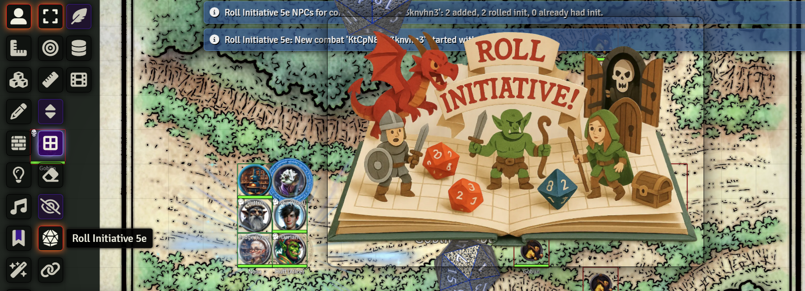

_**The corridor collapses into a vast chamber, the ceiling lost in shadow. A low rumble shakes the earth, followed by a whiff of smoke as you see scales glitter in the darkness. Roll for initiative!**_

...right click, sword icon, ok I added the dragon guys, just hold on

...and there's Throg, and Sir Reginald

...no Steve, you can't roll yet, I'm getting to you next...

It kind of ruins the moment, no?  But no longer! Now your declaration of imminent demise can be accompanied by a thunderous roar, the clatter of dice, and a brave announcement of doom!

# Roll Initiative 5e

Adds a GM button on the **Token** controls to (a) create/activate a combat on the current scene, (b) add PCs, (c) add any selected NPC tokens, and (d) roll initiative for NPCs that don't have it yet. Optionally shows a big "initiative flair" image and/or plays a sound when a new combat begins.

## Artwork Gallery

This module comes with 75+ AI-generated art assets and shows a random one each time combat starts.

## Install

**Manifest URL:**  
`https://github.com/danshapiro/fvtt-module-roll-initiative/releases/latest/download/module.json`

Foundry: **Setup → Add-on Modules → Install Module →** paste the Manifest URL → **Install**.

## Requirements

- Foundry VTT core **v11+** (verified on v11).  
- System: **D&D 5e (dnd5e)**.

## Setup & Usage

### Player Setup 
The module needs to know which characters are your players. Here's how to set it up:

1. **Open any player character sheet** in your world
2. **Right-click the book icon** at the top of the character sheet
3. **Click "Copy UUID"** - this copies a long string to your clipboard
4. **Go to Configure Settings → Module Settings → Roll Initiative 5e**
5. **Paste the UUID** into the "PC Actor UUIDs" field
6. **Repeat for each player character** - separate multiple UUIDs with commas

**Pro tip:** You only need to do this once per character ever.

### Using the Module
1. Make sure your player characters have tokens on the **current scene**
2. Optionally select one or more NPC tokens on the scene
3. Click the "Roll Initiative 5e" icon button (on the left hand side, looks like a d20)
4. The module will automatically:
   - Create/activate combat on the current scene
   - Add all your configured PCs to the combat (but not roll initiative)
   - Add NPC tokens, if you selected any
   - Roll initiative for NPCs that don't have it yet
   - Show a dramatic flair image and play a sound (if enabled)
5. If you haven't added the monsters yet, select them and click it again. It will quietly add them to the combat & roll their initiative.

### Customization Options
- **PC Actor UUIDs (world):** Your player character UUIDs (set up in Player Setup above)
- **Flair Asset Folder Path (world):** Path to your custom images/sounds (default: `modules/roll-initiative-5e/assets/`)
- **Enable Initiative Flair Animation (world):** Show dramatic images when combat starts
- **Enable Initiative Flair Sound Effect (world):** Play sounds with the flair
- **Flair Animation Stay Duration (ms) (world):** How long images stay visible
- **Animation Test Mode (client):** Preview all your flair assets

The module comes with 75+ AI-generated assets ready to use!

## License

MIT — see [LICENSE](./LICENSE).

